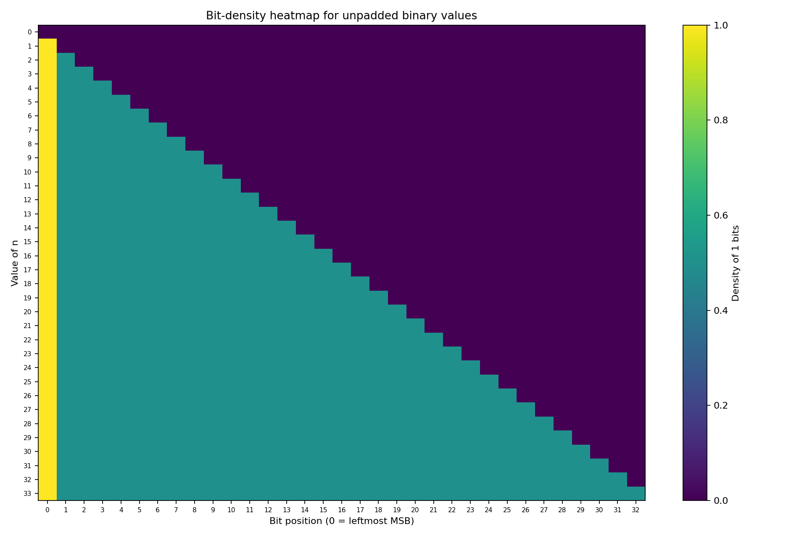
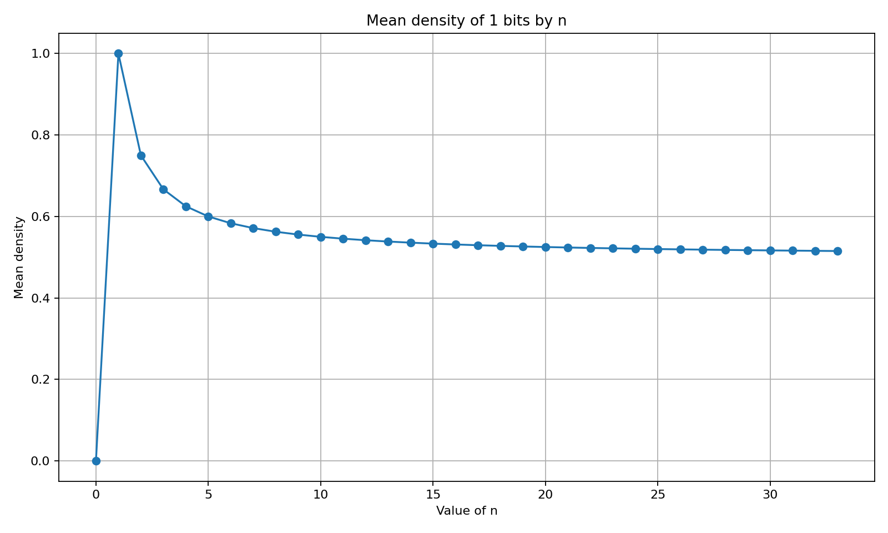
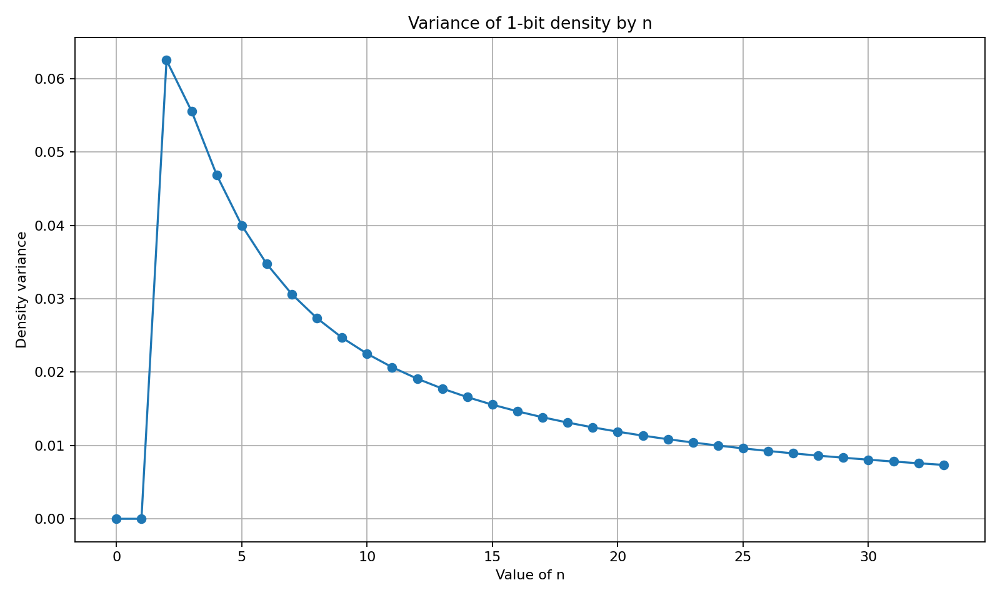

# Binary Universe Analyzer


A hybrid **C and Python** project for generating binary-string universes and analyzing bit-density statistics.

The C module exhaustively generates the strings in \(\Sigma^n\), where \(\Sigma = \{0,1\}\), using bitwise operations. The Python module calculates analytical statistics and visualizes density, logarithmic density, mean, and variance across values of `n`.

## Preview



<p align="center">
  
  
</p>

## Why this project matters

This project demonstrates:

- Algorithm design and complexity analysis.
- Bit manipulation in C.
- Dynamic memory management and file handling.
- Exponential-growth awareness.
- Analytical optimization to avoid processing multi-gigabyte files.
- Numerical computing with NumPy.
- Data visualization with Matplotlib.
- Integration of low-level generation and high-level analysis.

## Core features

### C generator

- Manual mode for a specific value of `n`.
- Automatic mode from `n = 0` to a selected upper bound.
- Generation of all \(2^n\) fixed-width binary strings.
- Bitwise construction using right shifts and bit masks.
- Text-file output in set notation.
- Time complexity of approximately \(O(n \cdot 2^n)\).

### Python analyzer

- Analytical calculation without reading the complete generated universe.
- Bit-density analysis by position.
- Natural-logarithm density heatmap.
- Mean and variance calculation.
- Visualization for values from `n = 0` to `n = 33`.

## Project structure

```text
binary-universe-analyzer/
├── assets/
│   ├── density-heatmap.png
│   ├── density-variance.png
│   ├── log-density-heatmap.png
│   └── mean-density.png
├── docs/
│   └── README.md
├── src/
│   ├── creacionDeCadenas.c
│   └── graficador.py
├── .gitignore
├── LICENSE
├── README.md
└── requirements.txt
```

## Requirements

### C

- GCC or MinGW.
- A terminal.
- Sufficient free disk space for generated files.

### Python

- Python 3.
- NumPy.
- Matplotlib.

Install the Python dependencies:

```bash
python -m pip install -r requirements.txt
```

## Build and run

### Compile the C generator

From the repository root:

```bash
gcc -std=c11 -Wall -Wextra -Wpedantic src/creacionDeCadenas.c -o binary-universe
```

On Windows with MinGW, the output may be:

```bash
gcc -std=c11 -Wall -Wextra -Wpedantic src/creacionDeCadenas.c -o binary-universe.exe
```

Run it on Windows:

```bash
binary-universe.exe
```

Run it on Linux or macOS:

```bash
./binary-universe
```

> The current source combines `system("cls")`, which is Windows-specific, with `unistd.h` and `sleep()`, which are POSIX-oriented. A portability refactor is listed in the roadmap.

### Run the Python analyzer

```bash
python src/graficador.py
```

## Example

For `n = 3`, the C module generates:

```text
Σ³ = {000, 001, 010, 011, 100, 101, 110, 111}
```

The number of strings is:

```text
2³ = 8
```

For a general `n`, the generation algorithm iterates over every integer from `0` to `2^n - 1` and extracts each bit using:

```c
(i >> j) & 1
```

## Scalability

The universe grows exponentially:

| n | Number of strings |
|---:|------------------:|
| 10 | 1,024 |
| 20 | 1,048,576 |
| 25 | 33,554,432 |
| 30 | 1,073,741,824 |
| 33 | 8,589,934,592 |

Generated text files can quickly become extremely large. For this reason:

- Generated `.txt` files are excluded by `.gitignore`.
- The compiled `.exe` is not stored in the repository.
- The Python module uses analytical formulas rather than loading the full dataset.

## Current implementation note

The C program generates **fixed-width strings with leading zeroes**, while the current Python module analyzes **unpadded binary representations** for integers from `1` to `2^n - 1`.

Unifying both representations is the main technical improvement planned for the next version. Documenting this distinction avoids presenting two different models as the same dataset.

## Roadmap

- Align the C and Python representations.
- Add command-line arguments.
- Save plots automatically from the Python program.
- Replace platform-specific screen-clearing and sleep calls.
- Estimate output size before starting generation.
- Add automated tests.
- Validate non-numeric user input.
- Add a safe cancellation mechanism.
- Benchmark file-writing performance.
- Provide a small sample dataset for demonstration.

## Academic context

Developed as a project for **Theory of Computation** at the Escuela Superior de Cómputo, Instituto Politécnico Nacional.

## Author

**Raúl Enrique Martínez Cruz**

## License

Distributed under the MIT License. See [LICENSE](LICENSE).
